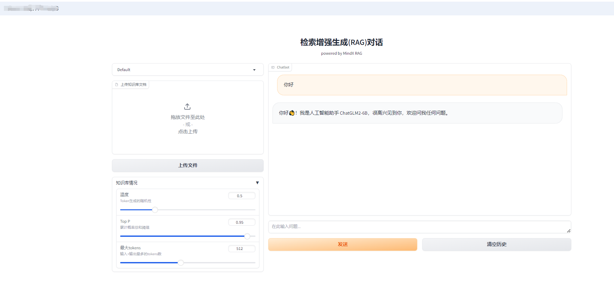

# RAG SDK运行说明

## 环境准备(容器化部署)

需按以下顺序完成依赖服务部署，确保各服务可正常通信：

1. 部署RAG SDK（[参考链接](https://www.hiascend.com/developer/ascendhub/detail/b875f781df984480b0385a96fa1b03c9)）
2. 部署LLM服务，（推荐：qwen2.5-32b-instruct，[参考链接](https://www.hiascend.com/developer/ascendhub/detail/125b5fb4e7184b8dabc3ae4b18c6ff99)）
3. 部署Milvus服务（支持v2.5.0及以上版本，[参考链接](https://milvus.io/docs/zh/install_standalone-docker.md)）
4. 部署mis-tei embedding与reranker服务（[参考链接](https://www.hiascend.com/developer/ascendhub/detail/07a016975cc341f3a5ae131f2b52399d)）
5. 部署OCR服务（[参考链接](https://vllm-ascend.readthedocs.io/en/latest/tutorials/single_npu_qwen2.5_vl.html)）
6. 图文并茂回答支持（可选）：  
   若需解析docx、pdf文件中的图片并生成图文回答，需额外部署VLM模型服务（推荐：qwen2.5-vl-7b-instruct，[参考链接](https://www.hiascend.com/developer/ascendhub/detail/9eedc82e0c0644b2a2a9d0821ed5e7ad)）。  
   > 注：长或宽小于256像素的图片因信息不足，将被自动丢弃。

## 运行Demo步骤

### 1. 容器内环境准备

进入ragsdk容器后，依次执行以下命令安装依赖、创建工作目录并准备代码：
```bash
# 安装文档转换依赖（libreoffice）与中文字体
apt-get install -y libreoffice fonts-noto-cjk

# 安装Python依赖包
pip3 install mineru streamlit

# 创建Demo工作目录并进入
mkdir -p /home/HwHiAiUser/workspace
cd /home/HwHiAiUser/workspace

# 编辑Demo代码文件（将仓库中的app.py内容复制到文件中）
vim app.py
```

### 2. 启动WEB服务
执行以下命令启动Streamlit服务，替换`服务端口`为实际可用端口（如8501）：
```bash
streamlit run app.py --server.address "127.0.0.1" --server.port 服务端口
```
> 安全提示：示例为简单部署，生产环境需开启HTTPS安全认证以保障服务安全。 

> 配置文件说明：代码运行之后，会自动生成参数配置文件，默认保存在/home/HwHiAiUser/workspace/config.json，可在app.py中进行修改

### 3. 访问与使用
在PC浏览器中输入地址访问：`http://服务IP:服务端口`  
进入界面后，即可完成参数配置、文档上传、删除、问答等操作。



