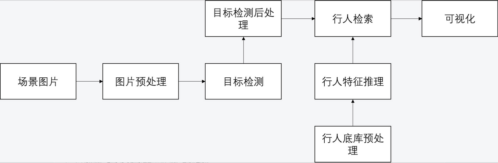

# MindXSDK 行人重识别v2

## 1 介绍
### 1.1 简介
本开发样例基于MxBase V2接口实现了端到端的行人重识别（Person Re-identification, ReID），支持检索给定照片中的行人ID。其主要流程为：
- 程序入口分别接收查询图片和行人底库所在的文件路径。
- 对于查询图片：利用目标检测模型YOLOv3推理，检测图片中的行人，检测结果经过抠图与调整大小，再利用ReID模型提取图片中每个行人的特征向量。
- 对于行人底库：将底库图片调整大小，利用ReID模型提取相应的特征向量。
- 行人检索：将查询图片中行人的特征向量与底库中的特征向量，为每个查询图片中的行人检索最有可能的ID，通过识别框和文字信息进行可视化标记。

**V1版本链接：**

https://gitee.com/ascend/mindxsdk-referenceapps/tree/master/contrib/ReID

**ReID论文地址：**

https://arxiv.org/pdf/1903.07071.pdf

**ReID代码地址：**

https://github.com/michuanhaohao/reid-strong-baseline

**方案实现流程图**

本方案采用Yolov3+ReID模型，按照行人检索+行人检索的方式实现行人重识别功能。首先，给定需要查询的行人图像（即行人底库，记为Query），利用ReID模型推理得到其特征矩阵；然后对于给定的图像库，利用Yolov3模型推理检测出每个图像中的所有行人（记为Gallery），再利用ReID模型推理得到的所有行人的特征矩阵；进一步，计算两个特征矩阵的距离，将每个Gallery特征距离最近的Query作为去识别结果；最后，将用一张场景图像中所有Gallery的识别结果去重，并在图像上可视化，流程图如下图所示：



**适用场景**
```
1) 与目标识别结合
ReID 技术和目标的技术可以做一个补充，当能看到目标的时候用目标的技术去识别，当看不到目标的时候用 ReID 技术去识别，可以延长行人在摄像头连续跟踪的时空延续性.
2) 智能安防
假如我已经知道某个嫌疑犯的照片ReID 根据嫌疑犯照片，去视频库里去收集嫌疑犯出现的视频段.
3) 智能商业-无人超市
无人超市也有类似的需求，无人超市不只是体验优化，它还要了解用户的购物行为，因为如果只基于目标来做，很多时候是拍不到客户的正面，ReID 这个技术在无人超市的场景下有非常大的应用帮助。
4) 相册聚类
现在拍照时，可以把相同人的照片聚在一起，方便大家去管理，这也是一个具象的应用场景。
...
```


### 1.2 支持的产品

本项目支持昇腾Atlas 300I pro、 Atlas 300V pro

### 1.3 支持的版本
本样例配套的MxVision版本、CANN版本、Driver/Firmware版本如下所示：

| MxVision版本  | CANN版本  | Driver/Firmware版本  |
| --------- | ------------------ | -------------- |
| 6.0.RC3   | 8.0.RC3   |  24.1.RC3  |

### 1.4 三方依赖

第三方依赖软件和版本如下表。请确认环境已安装pip3后，使用pip3 install * 安装以下依赖。

|软件名称    | 版本        |
|-----------|-----------|
| numpy     | 1.24.0    |
| opencv-python-headless   | 4.10.0.84 |
| pillow   | 10.4.0    |

### 1.5 代码目录结构说明
本工程名称为ReIDv2，工程目录如下图所示：
```
ReIDv2
|---- data
|       |---- gallerySet                  // 需要用户创建：查询场景图片文件夹
|       |---- querySet                    // 需要用户创建：行人底库图片文件夹
|---- image     
|       |---- flow_chart.jpg              // 流程图   
|       |---- result_v1.jpg               // V1识别结果例图
|       |---- V1_running_time.jpg         // V1运行时间图片
|       |---- result_v1.jpg               // V2识别结果例图
|       |---- V2_running_time.jpg         // V2运行时间图片
|---- models                              // 目标检测、ReID模型与配置文件夹
|       |---- yolov3.cfg
|       |---- coco.names
|       |---- ReID_onnx2om.cfg
|---- result                              // 结果保存文件夹            
|---- img.png              
|---- mainv2.py
|---- README.md   
```
> 由于无法在Gitee上创建空文件夹，请按照该工程目录，自行创建data内部的文件夹  
> 如果没有result文件夹，将无法产生输出


## 2. 设置环境变量

```bash
#设置CANN环境变量（请确认install_path路径是否正确）
. ${ascend-toolkit-path}/set_env.sh

#设置MindX SDK 环境变量，SDK-path为mxVision SDK 安装路径
. ${SDK-path}/set_env.sh
```
## 3 准备模型

### 3.1 yolov3的模型

**步骤1** 获取yolov3的原始模型(.pb文件)和相应的配置文件(.cfg文件)  
&ensp;&ensp;&ensp;&ensp;&ensp; [原始模型下载链接](https://c7xcode.obs.myhuaweicloud.com/models/YOLOV3_coco_detection_picture_with_postprocess_op/yolov3_tensorflow_1.5.pb)
&ensp;&ensp;&ensp;&ensp;&ensp; [配置文件下载链接](https://c7xcode.obs.myhuaweicloud.com/models/YOLOV3_coco_detection_picture_with_postprocess_op/aipp_nv12.cfg)

**步骤2** 将获取到的yolov3模型.pb文件和.cfg文件存放至：“项目所在目录/models”


**步骤3** .om模型转换

使用ATC将.pb文件转成为.om文件
```
atc --model=yolov3_tensorflow_1.5.pb --framework=3 --output=yolov3 --output_type=FP32 --soc_version=Ascend310P3 --input_shape="input:1,416,416,3" --out_nodes="yolov3/yolov3_head/Conv_6/BiasAdd:0;yolov3/yolov3_head/Conv_14/BiasAdd:0;yolov3/yolov3_head/Conv_22/BiasAdd:0" --log=info --insert_op_conf=aipp_nv12.cfg
```
（可以通过修改output参数来重命名这个.om文件）

- 执行完模型转换脚本后，若提示如下信息说明模型转换成功，可以在该路径下找到名为yolov3.om模型文件。

```
ATC run success, welcome to the next use.
```  


### 3.2 ReID的模型
**步骤1** 从GitHub拉取ReID模型源代码

在`项目所在目录/models`路径下输入：
```
git clone https://github.com/michuanhaohao/reid-strong-baseline
```
拉取成功后会在路径`项目所在目录/models`下看到文件夹`reid-strong-baseline`。


**步骤2** 获取`.pth`权重文件

&ensp;&ensp;&ensp;&ensp;&ensp; [Huawei Cloud](https://mindx.sdk.obs.cn-north-4.myhuaweicloud.com/mindxsdk-referenceapps%20/contrib/ReID/ReID%E7%9B%B8%E5%85%B3%E6%96%87%E4%BB%B6.rar)

通过上面的链接下载压缩包`ReID相关文件`。

将`ReID.pth模型`文件夹内的`market_resnet50_model_120_rank1_945.pth`权重文件 放在`项目所在目录/models`路径下。


**步骤3** 创建转换为onnx的脚本：

在`项目所在目录/models`路径下，创建py脚本：
```bash
vim ReID_pth2onnx.py
```

&ensp;&ensp;&ensp;&ensp;&ensp;[获取链接](https://gitee.com/ascend/ModelZoo-PyTorch/tree/master/ACL_PyTorch/contrib/cv/classfication/ReID_for_Pytorch)

将上面链接内的`ReID_pth2onnx.py`的代码写入文件内，然后`wq`保存退出。

在`项目所在目录/models`路径下，执行下列命令，生成.onnx模型文件：
```
python3 ReID_pth2onnx.py --config_file='reid-strong-baseline/configs/softmax_triplet_with_center.yml' MODEL.PRETRAIN_CHOICE "('self')" TEST.WEIGHT "('market_resnet50_model_120_rank1_945.pth')"
```
> 注意目前ATC支持的onnx算子版本为11

成功后 在`项目所在目录/models`路径下会出现ReID.onnx模型。


**步骤4** 使用ATC将.onnx文件转成为.om文件

在`项目所在目录/models`路径下执行：

```
atc --framework=5 --model=ReID.onnx --output=ReID --input_format=NCHW --input_shape="image:1,3,256,128" --insert_op_conf=ReID_onnx2om.cfg --log=debug --soc_version=Ascend310P3
```
- 执行完模型转换脚本后，若提示如下信息说明模型转换成功，可以在“项目所在目录/models”路径下找到名为ReID.om模型文件。（同样的，可以通过修改output参数来重命名这个.om文件）
```
ATC run success, welcome to the next use.
```  
经过上述操作，可以在“项目所在目录/models”找到yolov3.om模型和ReID.om模型。


## 4 运行

**步骤1：** 准备行人底库数据集

在3.2 步骤2 中下载的压缩包`ReID相关文件`中有`文件夹Market1501数据集`，该文件夹内有压缩文件`Market-1501-v15.09.15.zip`。

请解压“Market-1501-v15.09.15.zip”，在`Market-1501-v15.09.15\Market1501\gt_bbox`中选择想要查询的
行人图片，将图片放在`项目所在目录/data/querySet`中。（注意：`querySet`需要用户自行创建。）

> 推荐每次查询1人，使用2-6张图片作为底库，效果较好  
> 如需要查询多人，请保证待查询行人之间的着装风格差异较大，否则会较容易出现误报  
> 该项目需要为每张图片提取行人ID，行人图片的命名格式为
>> '0001(行人ID)_c1(相机ID)s1(录像序列ID)_000151(视频帧ID)_00(检测框ID).jpg'


**步骤2：** 准备场景图片数据集

在3.2 步骤2 中下载的压缩包`ReID相关文件`中有`场景图片`，该文件夹内有压缩文件`search_samples.rar`。
请解压“search_samples.rar”，然后将获取的图片放在`项目所在目录/data/gallerySet`中。
（注意：`gallerySet`需要用户自行创建。）
> gallery下的图片必须是1920*1080大小的jpg


**步骤3：** 运行


在`项目所在目录`下进入`mainv2.py` ， 检查调用的npu卡号是否正确(行数为原代码行数)：
```bash
53  DEVICE_ID = 0 # 实际使用npu卡id
```
并修改以下两行路径为用户实际路径(行数为原代码行数)：
```bash
59  LABEL_PATH = "/path/to/coco.names"  # 需要用户填写：coco.names的路径
60  CONFIG_PATH = "/path/to/mindxsdk-referenceapps/contrib/ReID/models/yolov3.cfg" # 需要用户填写：yolov3.cfg的路径
```


保存退出后，在`项目所在目录`下执行：
```bash
python3 mainv2.py --queryFilePath='data/querySet' --galleryFilePath='data/gallerySet' --matchThreshold=0.3
```
> matchThreshold是行人重定位的阈值，默认值是0.3，可根据行人底库的数量进行调整  
> 请注意这个阈值单位是距离单位，并不是比例阈值  
> 对market1501数据集，建议的范围是0.2~0.4之间

**步骤4：** 查看结果

执行`mainv2.py`文件后，可在`项目所在目录/result`路径下查看结果。


## 5 常见问题
· 在运行mainv2.py时出现"Vpc cropping failed"，或者"The image height zoom ratio is out of range [1/32, 16]"  
> 这里的错误是因为yolov3模型检测到的目标过小，抠图后放大的比例超过系统给定的阈值[1/32, 16]，更新“项目所在目录/models/yolov3.cfg”文件，将OBJECTNESS_THRESH适度调大可解决该问题
